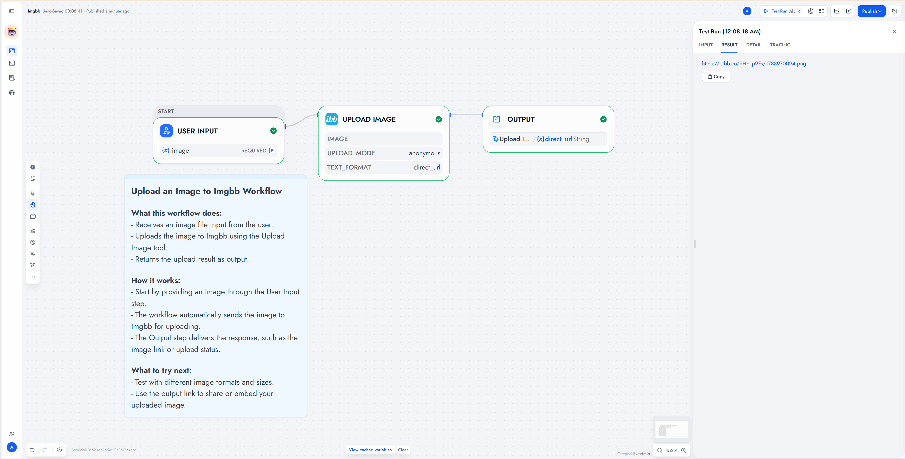

# ImgBB

Upload one image (up to 32,000,000 bytes) and get a direct URL, Markdown image, and HTML embed. Anonymous by default. API key is optional.

**Source:** [https://github.com/erbanku/imgbb](https://github.com/erbanku/imgbb)

**Contact:** [GitHub issues](https://github.com/erbanku/imgbb/issues)

## Overview

Bind a Dify image file to **Upload Image**. The plugin sends the original bytes to ImgBB and returns embed-ready outputs. No albums, no account cookies, no resize or EXIF stripping.

## Setup

1. Install **ImgBB** from the Dify Plugin Marketplace (or from this repository's package).
2. For anonymous uploads, leave the provider **API key** blank and save.
3. To use the official API, add an [ImgBB API key](https://api.imgbb.com/).
4. Add **ImgBB → Upload Image** to a Chatflow, Workflow, or Agent.
5. Connect one native Dify image file to **Image**. For many files, use an Iteration node.

### Use the tool

- **Chatflow / Workflow:** bind a file variable to **Image**. Connect `text` or named outputs (`direct_url`, `markdown`, `html`) downstream.
- **Agent:** add Upload Image, then give the agent a Dify file to upload.

## Screenshots



## Inputs


| Input              | Required           | Notes                                  |
| ------------------ | ------------------ | -------------------------------------- |
| Image              | Yes                | One Dify file, not a URL or path       |
| Upload Mode        | Default Anonymous  | Website upload or API-key upload       |
| Image Name         | No                 | Custom name, or Unix timestamp seconds |
| Text Output Format | Default Direct URL | URL, Markdown, or both                 |


Usage details

Named `direct_url`, `markdown`, and `html` outputs are always filled. `text` follows **Text Output Format**.

Example JSON:

```json
{
  "direct_url": "https://i.ibb.co/example/report.png",
  "markdown": "",
  "html": "",
  "name": "report",
  "filename": "report.png",
  "size": 12345,
  "upload_mode": "anonymous"
}
```

**Anonymous** opens `https://imgbb.com/`, reads the public form token, and posts to `https://imgbb.com/json`. That flow can change or show a browser challenge. The plugin reports the failure. It does not bypass challenges.

**API key** posts to `https://api.imgbb.com/1/upload`. No silent fallback to anonymous.

No automatic retries. A lost response can still mean the image was published.


Limits and security

- Hard size cap: 32,000,000 bytes (32 MiB is over the limit).
- Common formats: PNG, JPEG, GIF, WebP, BMP, TIFF, AVIF, HEIC/HEIF, ICO. ImgBB still validates the file.
- Uploads do not follow redirects. File downloads use a client without ImgBB credentials.
- Returned URLs are public host links, not private storage. Do not upload secrets.

See [PRIVACY.md](./PRIVACY.md).


References

- [ImgBB API](https://api.imgbb.com/)
- [ImgBB website](https://imgbb.com/)

Independent integration. ImgBB name and icon belong to their owners.

